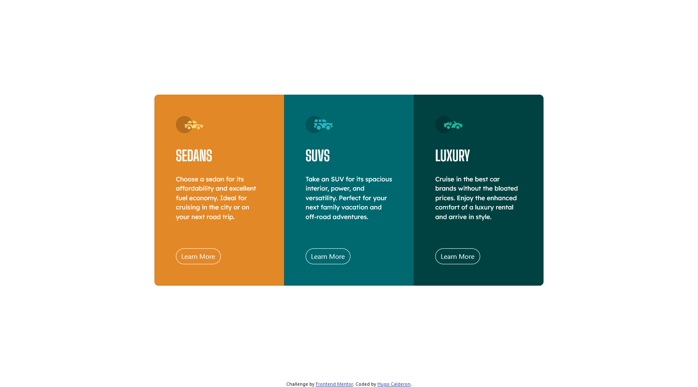

# Frontend Mentor - 3-column preview card component solution

This is a solution to the [3-column preview card component challenge on Frontend Mentor](https://www.frontendmentor.io/challenges/3column-preview-card-component-pH92eAR2-). Frontend Mentor challenges help you improve your coding skills by building realistic projects. 

## Table of contents

- [Overview](#overview)
  - [The challenge](#the-challenge)
  - [Screenshot](#screenshot)
  - [Links](#links)
- [My process](#my-process)
  - [Built with](#built-with)
  - [Useful resources](#useful-resources)
- [Author](#author)

## Overview

### The challenge

Users should be able to:

- View the optimal layout depending on their device's screen size
- See hover states for interactive elements

### Screenshot

Add a screenshot of your solution. The easiest way to do this is to use Firefox to view your project, right-click the page and select "Take a Screenshot". You can choose either a full-height screenshot or a cropped one based on how long the page is. If it's very long, it might be best to crop it.

### Links

- Solution URL: [Solution URL here](https://blissful-almeida-1fe7b7.netlify.app/)

## My process

### Built with

- Semantic HTML5 markup
- CSS custom properties
- Mobile-first workflow
- Bootstrap 5

### Useful resources

- [getbootstrap.com](https://getbootstrap.com).
- [netlify.com](netlify.com) - This platform supports me in seeing my project live.

## Author

- Website - [Hugo Calderón](https://hugocalderon.github.io/)
- Frontend Mentor - [@hugocalderon](https://www.frontendmentor.io/profile/hugocalderon)
